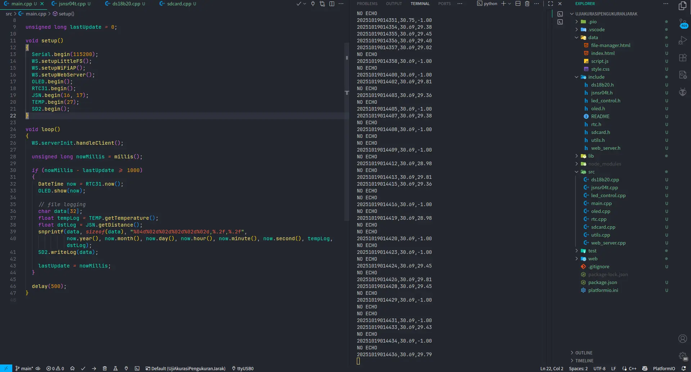

# <mark>Distance Measurement Accuracy Test</mark> — ESP32

<p align="center">
	
</p>

## ✨ What it does

- Logs temperature (DS18B20) and distance (JSN-SR04T) to CSV files on an SD card.
- Shows status on SSD1306 OLED and uses a DS3231 RTC for timestamps.
- Serves a simple web UI from LittleFS and provides APIs to list/read logs and set the RTC.

## ⚙️ Quick specs

- Platform: ESP32 (PlatformIO)
- Logs: `/data/log/dmat/LOG_YYYYMMDD.csv` (CSV header: `timestamp, temperature, distance`)
- Sampling: ~1 Hz (see `src/main.cpp`)

## 🔌 Default pins (check your board)

- Ultrasonic (JSN-SR04T): TRIG = GPIO16, ECHO = GPIO17
- DS18B20 (1-Wire): DATA = GPIO27 (use 4.7k pull-up)
- SD CS: GPIO5 (SPI uses VSPI default pins)
- I2C (OLED + RTC): SDA / SCL (common defaults SDA=21, SCL=22)

## 📡 Web & networking

- Tries STA first (credentials in `src/web_server.cpp`), falls back to AP mode.
- Default STA: `SSID` / `password` (change before deploy)
- Default AP: `ESP32-Device` / `12345678`

## 📁 Useful endpoints

- GET `/api/listdir?path=/&levels=1` — list files on SD
- GET `/api/readfile?path=/data/log/dmat/LOG_YYYYMMDD.csv` — download file
- GET `/api/rtc/set-time?yyyy=YYYY&mm=MM&dd=DD&h=HH&m=MM&s=SS` — set RTC

## 🚀 Build & upload (PlatformIO)

From the project root:

```bash
# build
pio run

# upload firmware
pio run -t upload

# upload LittleFS (if configured)
pio run -t uploadfs

# serial monitor
pio device monitor -b 115200
```

## 🛠 Notes & troubleshooting

- SD: `SD Card mount failed!` will halt the app — check CS wiring (GPIO5) and 3.3V power.
- LittleFS: if mount fails, re-upload or reformat the `data/` folder.
- WiFi: check STA creds; serial prints IP or AP mode status at 115200.
- Sensors: verify wiring and pull-up for DS18B20. Use serial logs to debug readings.

## 🔧 Where to change things

- WiFi creds: `src/web_server.cpp`
- Pins & sensor init: `src/main.cpp`
- CSV filename prefix: `src/sdcard.cpp`

## 📦 License

- [MIT License](LICENSE).


